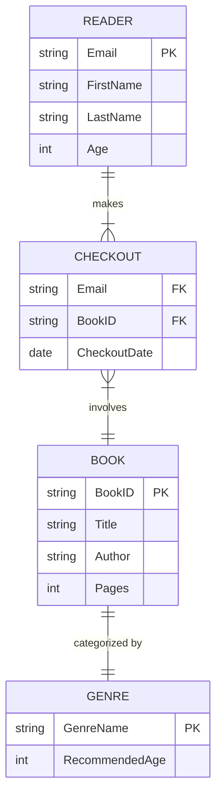

# NOTES NOTES NOTES NOTES NOTES NOTES
# NOTES NOTES NOTES NOTES NOTES NOTES

# DATA 514 Section 4 Worksheet - Jonathan Jacobs

### Question 1

To design the ER diagram for the Odegaard Library database based on the provided specifications, we must consider the entities involved, their attributes, and the relationships between these entities. Here's a breakdown of how the entities and relationships should be structured:

### Entities and Attributes:
1. **Book**
   - Attributes: BookID (PK), Title, Author, Genre, Pages, RecommendedAge
   - The inclusion of `RecommendedAge` suggests a normalization where `Genre` is linked to a typical `RecommendedAge` for the genre.

2. **Reader**
   - Attributes: Email (PK), FirstName, LastName, Age

3. **Checkout**
   - Attributes: Email (FK), BookID (FK), CheckoutDate
   - This entity represents the many-to-many relationship between books and readers, where a book can be checked out multiple times and readers can check out multiple books. The inclusion of `CheckoutDate` directly in this entity allows us to track when each book is checked out by a reader.

4. **Genre**
   - Attributes: GenreName (PK), RecommendedAge
   - This entity is normalized from the `Book` entity to manage the recommended age for each genre effectively.

### Relationships:
- **Books to Genre**: One-to-Many (One genre can categorize many books, a book belongs to one genre).
- **Readers to Checkout**: One-to-Many (A reader can have multiple checkout records, a checkout record belongs to one reader).
- **Books to Checkout**: One-to-Many (A book can be checked out multiple times, each checkout record refers to one book).

### Assumptions:
- Each book has only one genre.
- The recommendation age is consistent per genre and is stored with the genre.
- Readers are uniquely identified by their email addresses.

Next, I will draft the ER diagram in Mermaid notation and visualize it. Here's the draft:



I will now create this diagram using the Mermaid tool and provide you with the visual representation of the ER diagram for Odegaard Library's database requirements.

Here is the ER diagram for the Odegaard Library's new database based on the requirements you provided:


This diagram should provide a clear view of the entities, their attributes, and the relationships among them, tailored to meet all specified requirements for the library's database. If you need further modifications or have additional requirements, please let me know!


## Question 2
Great, you've got your worksheet for designing a new library database at Odegaard Library. Let's tackle these tasks one by one. Here's what you need to do:

### 1. Design an ER diagram for the new library database
Here are the requirements translated into an ER diagram setup:

- **Entities:**
  - **Book**: Attributes include Book ID (unique), Title, Author, Genre, Number of Pages.
  - **Reader**: Attributes include Email (unique), First Name, Last Name, Age.

- **Relationships:**
  - **Check Out**: A many-to-many relationship between Readers and Books since a reader can check out multiple books and each book can be checked out by multiple readers. Attributes of this relationship include the Check-Out Date.
  - **Genre Recommendation**: A one-to-many relationship from Genre to Books. It is assumed that each Genre has a recommended age, which could affect multiple books.

### 2. Convert the ER diagram to a series of CREATE TABLE statements
Based on the ER diagram, here are the SQL statements:

```sql
CREATE TABLE Readers (
    Email VARCHAR(255) PRIMARY KEY,
    FirstName VARCHAR(100),
    LastName VARCHAR(100),
    Age INT
);

CREATE TABLE Books (
    BookID INT PRIMARY KEY,
    Title VARCHAR(255),
    Author VARCHAR(100),
    Genre VARCHAR(100),
    NumPages INT,
    RecommendedAge INT,
    FOREIGN KEY (Genre) REFERENCES Genres(GenreName)
);

CREATE TABLE Genres (
    GenreName VARCHAR(100) PRIMARY KEY,
    RecommendedAge INT
);

CREATE TABLE CheckOut (
    Email VARCHAR(255),
    BookID INT,
    CheckOutDate DATE,
    FOREIGN KEY (Email) REFERENCES Readers(Email),
    FOREIGN KEY (BookID) REFERENCES Books(BookID),
    PRIMARY KEY (Email, BookID, CheckOutDate)
);
```

### 3. Functional Dependencies & BCNF Decomposition

#### Functional Dependencies Identification
From the given data:
- **car_type → car_color, is_electric, is_yellow, license_plate**
  - Assuming each car type uniquely determines its color, whether it's electric, its color category (yellow or not), and its license plate.

#### Closure of Determinants:
- **{car_type}+** = car_type, car_color, is_electric, is_yellow, license_plate

#### BCNF Decomposition Example:
Given dependencies and relation `R(A, B, C, D, E)`:
- **Initial Dependencies**: A → C, BD → A, D → E
- **Decomposition Steps**:
  - Split based on A → C: 
    - Table1: A, C
    - Table2: A, B, D, E
  - Since D → E in Table2 and D can be a key there, decompose further:
    - Table3: D, E
    - Table4: A, B, D

#### Tables with Keys:
- **Table1 (A, C)** - Key: A
- **Table3 (D, E)** - Key: D
- **Table4 (A, B, D)** - Key: BD

Each step ensures the table conforms to BCNF, where each determinant is a candidate key, removing partial and transitive dependencies that could lead to anomalies.

If you need diagrams or further explanations for any specific part, let me know!


## Question 3


The ER diagram you've provided represents the structure of a restaurant's ordering system. Here's a breakdown of its components and how they interrelate:

1. `Ingredient`: This is a table that lists ingredients used in dishes. Each ingredient has a unique identifier (`iid`) and a name. It can also have an associated allergen.

2. `Dish`: Represents the dishes on the menu. Each dish has a unique identifier (`did`), a name, a description, and belongs to a category.

3. `Order`: This table tracks customer orders. Each order has a unique identifier (`oid`).

4. `DishOrder`: A junction table that connects `Dish` and `Order`, representing the many-to-many relationship between them. Each entry in `DishOrder` refers to a specific `Order` and a specific `Dish` and includes a quantity (`num`).

5. `IngredientIn`: Another junction table that represents a many-to-many relationship between `Ingredient` and `Dish`. It shows which ingredients go into which dishes.

The cardinality between the entities suggests the following:

- An `Ingredient` can be part of zero or more `Dishes`, implying that some ingredients may not be used in any dish currently on the menu.
- A `Dish` consists of one or more `Ingredients`.
- An `Order` consists of one or more `Dishes`, and each `Dish` can appear in zero or more `Orders`, indicating that some dishes may not have been ordered yet.

The `>0` annotations indicate that at least one instance on that side of the relationship is required. For example, for a record to exist in the `DishOrder` table, there must be at least one `Dish` associated with it. Similarly, a record in `IngredientIn` must be associated with at least one `Dish`.

This structure allows for complex queries such as finding all orders containing a particular ingredient, identifying which dishes have a certain allergen, or summarizing the number of times a dish has been ordered.


```sql
CREATE TABLE Ingredient (
    iid INT PRIMARY KEY,
    name VARCHAR(255),
    allergen VARCHAR(255) -- Assuming allergen is just a text field, not a foreign key to an allergen table
);

CREATE TABLE Dish (
    did INT PRIMARY KEY,
    name VARCHAR(255),
    description TEXT,
    category VARCHAR(255)
);

CREATE TABLE Order (
    oid INT PRIMARY KEY
);

CREATE TABLE DishOrder (
    oid INT,
    did INT,
    num INT,
    PRIMARY KEY (oid, did),
    FOREIGN KEY (oid) REFERENCES Order(oid),
    FOREIGN KEY (did) REFERENCES Dish(did)
);

CREATE TABLE IngredientIn (
    iid INT,
    did INT,
    PRIMARY KEY (iid, did),
    FOREIGN KEY (iid) REFERENCES Ingredient(iid),
    FOREIGN KEY (did) REFERENCES Dish(did)
);

```

## Explanation
1. **Ingredient Table**: Holds the data for each ingredient, which is identified by a unique identifier `iid`.
2. **Dish Table**: Contains the details for each dish offered, with each dish having a unique identifier `did`.
3. **Order Table**: Keeps track of customer orders where each order is uniquely identified by `oid`.
4. **DishOrder Table**: Acts as a junction table between `Dish` and `Order`, denoting which dishes have been ordered and in what quantity. It uses composite keys made of `oid` and `did` for unique identification and includes `num` to indicate how many of each dish was ordered.
5. **IngredientIn Table**: Functions as a junction table to manage the many-to-many relationship between `Ingredients` and `Dishes`, indicating which ingredients are used in which dishes. It also uses a composite key consisting of `iid` and `did`.


## Functional Dependencies
Certainly, here is a comprehensive analysis of the functional dependencies and the closures for the determinants based on the dataset provided:

Within the given relation, we can observe the following functional dependencies:

1. The `license_plate` uniquely identifies each row, which implies the following functional dependency:
   - `license_plate → car_type, car_color, is_electric, is_yellow`
   The closure of `{license_plate}` therefore includes all the attributes in the relation, as the license plate number is unique to each vehicle.
   - Closure: `{license_plate}+ = {car_type, car_color, is_electric, is_yellow, license_plate}`

2. The combination of `car_type` and `car_color` is observed to determine the `is_electric` attribute, given that within the dataset, no two vehicles of the same type and color have different `is_electric` values. This leads to the second functional dependency:
   - `car_type, car_color → is_electric`
   The closure for the combination `{car_type, car_color}` includes the `is_electric` attribute.
   - Closure: `{car_type, car_color}+ = {car_type, car_color, is_electric}`

These conclusions are drawn from the explicit content of the dataset. It's important to note that the dataset as provided is a snapshot, and these dependencies hold true for the data at hand. Should the dataset be expanded or varied, the functional dependencies and closures may require reassessment.


## BCNF Decomposition

To solve the problem of decomposing the relation R(A, B, C, D, E) into BCNF, we start by calculating the closures for the sets {A}, {B}, {D}, and {BD}. Then, using the given functional dependencies, we decompose the relation into BCNF, ensuring each relation in the decomposition adheres to the BCNF conditions.

### Step 1: Calculate Closures
- **{A}+**: Given that A → C, the closure of {A} would include A and C. Since no other functional dependencies provide additional attributes based on A or C, the closure is {A, C}.
- **{B}+**: No functional dependencies have B on the left-hand side. Hence, B alone cannot determine any other attributes. The closure of {B} is {B}.
- **{D}+**: Given that D → E, the closure of {D} includes D and E. Again, there are no additional attributes determined by D or E alone, so the closure is {D, E}.
- **{BD}+**: Since BD → A and D → E, from BD we can determine A and E. Therefore, BD determines all attributes, A, B, C, D, E (because A → C also applies). Thus, the closure of {BD} is {A, B, C, D, E}.

### Step 2: Decompose into BCNF

BCNF requires that for every functional dependency X → Y in a relation, X should be a superkey. We check each functional dependency and decompose if it violates this rule:

1. **Check and Decompose for A → C**:
   - In R(A, B, C, D, E), A → C is not a superkey because {A}+ = {A, C} does not include all attributes of R.
   - **Decompose**: 
     - R1: (A, C) where A is a key.
     - R2: (A, B, D, E) with A removed as it is fully functionally dependent on C in R1.

2. **Check and Decompose R2 for BD → A**:
   - In R2(A, B, D, E), BD → A does meet the condition of BD being a superkey (since {BD}+ = {A, B, D, E} includes all attributes in R2). Thus, no further decomposition based on BD → A is required.

3. **Check R2 for D → E**:
   - In R2(A, B, D, E), D → E does not meet the BCNF condition as D is not a superkey (since {D}+ = {D, E}).
   - **Decompose**:
     - R3: (D, E) where D is a key.
     - R4: (A, B, D) with E removed.

### Final Decomposition:
- **R1: (A, C)** where A is a key.
- **R3: (D, E)** where D is a key.
- **R4: (A, B, D)** where BD is a key.

Each resulting relation now satisfies BCNF because the determining attribute set in each functional dependency of each relation is a superkey of that relation. This decomposition ensures no redundancy based on the functional dependencies provided.


