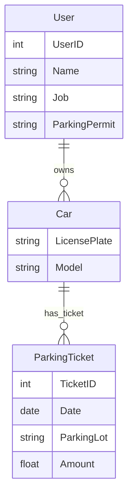

# DATA 514 Section 9 Worksheet - Jonathan Jacobs

## Question 1: Wide Column Database Implementation
### Keyspace and Column Families
**Keyspace**: `ParkingEnforcement`

**Column Families**:
1. **Payroll**
2. **Regist**
3. **ParkingTickets**
### Detailed Schema
1. **Payroll**:
   - **Row Key**: `UserID`
   - **Columns**: 
     - `Name`
     - `Job`
     - `ParkingPermit`

2. **Regist**:
   - **Row Key**: `UserID`
   - **Columns**:
     - `Car_<index>` (for handling multiple cars, e.g., Car_1, Car_2)
     - `LicensePlate_<index>` (for handling multiple license plates, e.g., LicensePlate_1, LicensePlate_2)

3. **ParkingTickets**:
   - **Row Key**: `LicensePlate`
   - **Columns**:
     - `ParkingLot_<index>` (for handling multiple tickets, e.g., ParkingLot_1, ParkingLot_2)
     - `Date_<index>` (for handling multiple dates, e.g., Date_1, Date_2)
     - `Amount_<index>` (for handling multiple amounts, e.g., Amount_1, Amount_2)
### Implementation Details
**Payroll**:
- The `Payroll` column family stores details about the employees. Each row is keyed by the `UserID`, ensuring unique entries for each user.
- Columns within each row include the `Name`, `Job`, and `ParkingPermit` of the employee.
**Regist**:
- The `Regist` column family stores information about the cars owned by users. Each row is keyed by the `UserID`, ensuring unique entries for each user.
- Users can own multiple cars, so the schema supports multiple entries using indexed columns. For example, a user with two cars would have columns `Car_1`, `LicensePlate_1`, `Car_2`, and `LicensePlate_2`.
**ParkingTickets**:
- The `ParkingTickets` column family tracks parking tickets. Each row is keyed by the `LicensePlate`, ensuring unique entries for each car.
- A single car can have multiple tickets, so the schema supports multiple entries using indexed columns. For example, a car with two tickets would have columns `ParkingLot_1`, `Date_1`, `Amount_1`, `ParkingLot_2`, `Date_2`, and `Amount_2`.
### Use of Explicit Timestamps
- Explicit timestamps can be used to track the creation and modification times of each column entry, ensuring data consistency and enabling versioning if necessary.
- In a wide column database like Cassandra, each column can have an associated timestamp that indicates when the data was written, which is useful for handling conflicts and ensuring data integrity.

## Question 2: Graph Database
#### Nodes and Relationships
**Nodes**:
1. **User**
2. **Car**
3. **ParkingTicket**

**Relationships**:
1. **OWNED_BY**
2. **HAS_TICKET**

#### Node Details
1. **User**:
   - Properties:
     - `UserID`
     - `Name`
     - `Job`
     - `ParkingPermit`
2. **Car**:
   - Properties:
     - `LicensePlate`
     - `Model`
3. **ParkingTicket**:
   - Properties:
     - `TicketID`
     - `Date`
     - `Amount`
     - `ParkingLot`
#### Relationship Details
1. **OWNED_BY**:
   - Connects: `Car` -> `User`
   - Properties: None
2. **HAS_TICKET**:
   - Connects: `Car` -> `ParkingTicket`
   - Properties: None
### Implementation Details
**User Nodes**:
- Represent individuals in the payroll system.
- Each `User` node includes properties for `UserID`, `Name`, `Job`, and `ParkingPermit`.
**Car Nodes**:
- Represent cars registered in the system.
- Each `Car` node includes properties for `LicensePlate` and `Model`.
**ParkingTicket Nodes**:
- Represent individual parking tickets.
- Each `ParkingTicket` node includes properties for `TicketID`, `Date`, `Amount`, and `ParkingLot`.
**Relationships**:
- `OWNED_BY`: This relationship connects a `Car` node to a `User` node, indicating ownership. Each car is related to its owner via this relationship.
- `HAS_TICKET`: This relationship connects a `Car` node to a `ParkingTicket` node, indicating that the car has received a particular parking ticket. Each car can have multiple `HAS_TICKET` relationships, each linking to a different parking ticket.
### Queries Supported
1. **Listing the permitted parking lot and per-car tickets incurred by each user**:
   - Traverse from `User` to `Car` via `OWNED_BY` relationships, and from `Car` to `ParkingTicket` via `HAS_TICKET` relationships to list all tickets for each user's cars.
2. **Counting how many tickets a license plate has ever had**:
   - Traverse from `Car` to `ParkingTicket` via `HAS_TICKET` relationships and count the number of connections.
3. **Determining whether a plate is allowed to be in a specific lot**:
   - Check the `ParkingPermit` property of the `User` node connected to the `Car` node via `OWNED_BY` relationship to verify if the car is allowed in the specified parking lot.

### Graph Database Schema in Mermaid Notation

