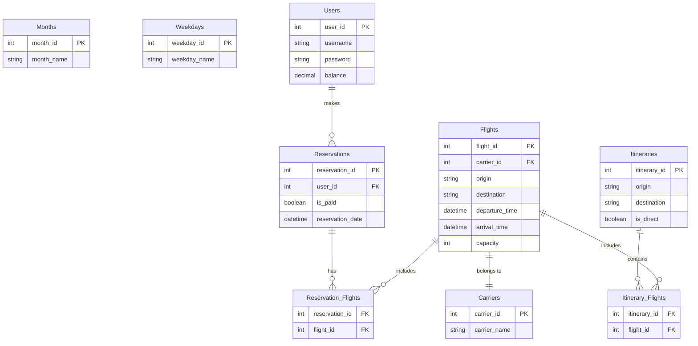
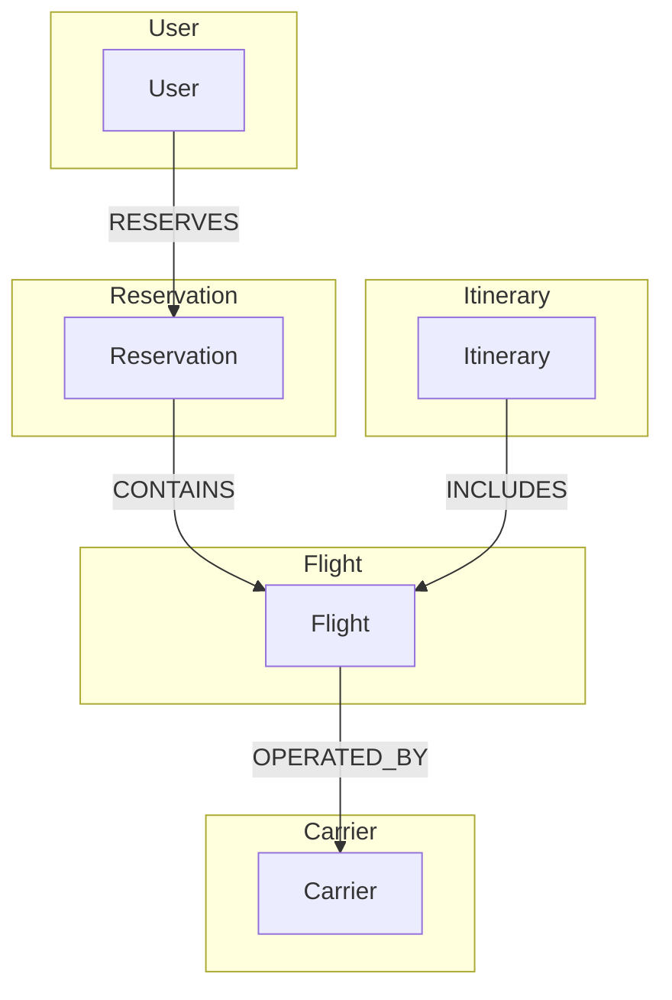

# Homework 7 - NoSQL Design - Jonathan Jacobs

### Introduction
Congratulations! You've been hired at Flightapp, Silicon Valley's hottest unicorn, which sells tickets to flights that have already departed. Your employers were deeply impressed with your experience with the July 2015 flights dataset and are excited to have their newhire design a schema that will WOW! investors and secure their next billion dollars.
✨✨
To help them choose a schema, they've asked you to write five "one-pagers" describing how to design Flightapp in the following:
	● a relational database (eg, Microsoft SQLServer)
	● a key-value database (eg, AWS DynamoDB)
	● a document store (eg, Asterix)
	● a graph database (eg, Neo4j)
	● a wide column database (eg, Google Cloud Bigtable)

### Homework Requirements
#### Describing a Data Model
For each NoSQL family, we have provided prompts/questions on Gradescope to get you pointed in the right direction; do them first. These prompts are not required, not worth points, and will not yield a fully-designed schema; they are, however, enough to guide you approximately halfway through the design. For the other half, you will provide a few paragraphs of high-level description and then answer a few questions (which are worth points) that assess your design's functionality.

The phrase "high level description" means that it is not necessary to give table creation statements or even to select a specific database management system. While it is tempting to get into the details of transaction handling or high performance writes, the goal of this assignment is to give a brief taste of NoSQL design. The sample solution is only 5 pages long (including rather large screenshots!) and only describes the rows and columns, plus a short paragraph about the trickier use-cases (eg, reserve). That’s it. This spec and its associated documentation is longer than the sample solution!

Some students benefit from being able to create specific key stores/datasets/tables and test queries on them. For those students, we include a "recommended sandbox"; for students who do not find sandboxes helpful, you can safely ignore these recommendations. (note: the sample solution is written without the aid of a sandbox).

Most students find it helpful to see an example problem; to assist, we have released the Payroll/Registry/ParkingTickets example here.

#### Functional Specification
Flightapp consists of the following logical entities. These entities are not necessarily database
tables; it is up to you to decide what entities to store persistently.
	● Flights / Carriers / Months / Weekdays: modeled the same way as HWs 1-3. For this project you should consider these entities to be read-only. Also, we introduce the concept of a flight's reservable capacity; if a flight's capacity is n and there are k existing reservations for it (see below), then its reservable capacity is n-k.
	● Users: A user has a username, password, and balance in their account. All usernames should be unique in the system. A user can have any number of reservations.
	● Itineraries: An itinerary is one or more flights connecting an origin city to a destination city. Unlike HW3, we are not constrained to 3-hop itineraries – there can be an arbitrary number of intermediate cities – however, we define a direct itinerary as one that does not have any intermediate cities (in other words, an itinerary consisting of a single flight).
	● Reservations: A reservation is similar to an itinerary in that it consists of one or more flights. Reservations are different in a few key aspects, however:
 		○ A reservation is a sequence of flights associated with a specific user
		○ The existence of a reservation decrements the reservable capacity of each of its component flights. Using the previous example, if flight f has a reservable capacity of n-k, then only n-k future reservations which include f can be made. Please note that, unlike the rest of the flight attributes, reservable capacity is not read-only.
	Each reservation can be marked as either be paid or unpaid, and a reservation must have a unique ID associated with it.

In addition to these logical entities, Flightapp must support the following operations:
	● **create(username, balance, password)** - creates a new user account with the specified parameters. Although we do not discuss password management in this class, we have released supplemental information about cryptographic hashing and password salting.
	● **search(origin, dest, day_of_month, directonly)** - returns itineraries that match a user's requested parameters. If the user specifies directonly, only direct itineraries should be returned.
	● **reserve(fid1, ..., fidn)** - reserves the specified flights. It should verify:
		○ That all the component flights have remaining reservable capacity
		○ That the user does not have another reservation on the same day Once these conditions have been verified, reserve() should decrement the flights' reservable capacity and then assign a unique ID for the reservation.
	● pay(reservation_id) - decrements the associated user’s balance and marks the reservation as paid. It is an error if the user attempts to pay for a reservation that they do not have sufficient funds for.
	● list_reservations(user_id) - lists all reservations, both paid and unpaid, for the specified user.


## Problem Set
#### Expected Query Patterns
Designing a NoSQL schema requires understanding the pattern of reads/writes to its data. You may make the following assumptions:
	● Carrier, month, and weekday data will never change.
	● Flight information will be updated very rarely (eg, once a week). Also, these updates will happen in bulk; there are no incremental changes to the flight data.
		○ eg, we might replace the entire July 2015 dataset with August 2015’s data.
	● We expect users to be created rarely (eg, a few times a day), and we expect users to login at a moderate frequency (eg, a few times an hour).
	● We expect users to reserve, pay, and view reservations at a moderate frequency (eg, a few times an hour)
	● You can assume a moderate number of users (eg, N million, where N is a double-digit number) registered in your system.
	● We expect users to search for itineraries quite frequently: several times a second when aggregated across our full userbase.

# Answers: 

## Question 1 - Relational Database
Present an ER diagram for Flightapp's logical entities. This diagram must be able to support all of Flightapp's use-cases; notably, if the Flights table is read-only, how might you represent (or dynamically calculate) a flight's reservable capacity?
Recommended Sandbox: You can use SQLite or your existing Azure SQLServer instance.

### ER Diagram Design for Relational Database (Flightapp)
#### Logical Entities and Relationships
1. **Flights**: Stores information about individual flights.
2. **Carriers**: Stores information about flight carriers.
3. **Months**: Stores information about months.
4. **Weekdays**: Stores information about weekdays.
5. **Users**: Stores user information including username, password, and account balance.
6. **Itineraries**: Represents one or more flights connecting an origin city to a destination city.
7. **Reservations**: Represents a user's reservation, consisting of one or more flights.
#### Operations Supported
- `create(username, balance, password)`
- `search(origin, dest, day_of_month, directonly)`
- `reserve(fid1, …, fidn)`
- `pay(reservation_id)`
- `list_reservations(user_id)`
#### Tables and Columns
- **Flights**
  - `flight_id` (PK)
  - `carrier_id` (FK)
  - `origin`
  - `destination`
  - `departure_time`
  - `arrival_time`
  - `capacity`
  - `reservable_capacity` (calculated dynamically based on reservations)
- **Carriers**
  - `carrier_id` (PK)
  - `carrier_name`
- **Months**
  - `month_id` (PK)
  - `month_name`
- **Weekdays**
  - `weekday_id` (PK)
  - `weekday_name`
- **Users**
  - `user_id` (PK)
  - `username` (unique)
  - `password`
  - `balance`
- **Itineraries**
  - `itinerary_id` (PK)
  - `origin`
  - `destination`
  - `is_direct` (boolean)
- **Itinerary_Flights** (link table for many-to-many relationship between Itineraries and Flights)
  - `itinerary_id` (FK)
  - `flight_id` (FK)
- **Reservations**
  - `reservation_id` (PK)
  - `user_id` (FK)
  - `is_paid` (boolean)
  - `reservation_date`
- **Reservation_Flights** (link table for many-to-many relationship between Reservations and Flights)
  - `reservation_id` (FK)
  - `flight_id` (FK)
#### Dynamic Calculation of Reservable Capacity
- Reservable capacity is calculated as `capacity - COUNT(reservation_id)` where `flight_id` is the same in the `Reservation_Flights` table.
### ER Diagram in Mermaid Notation

### Diagram Rendering
I will now render the ER diagram.

You can view and edit the diagram further using [this link](https://www.mermaidchart.com/app/mermaid-chart-save/2024-05-25/45a7fe9d-114c-415e-bee6-fa284f9e0144).


## Question 2 - Key-Value Data Store
Describe how you would implement the flights application using a key-value data store. Your description should contain enough detail that we understand the key (or keys if you have multiple “types” of keys), any structure that you introduce into the key, and the structure of a key’s value.
Recommended Sandbox: If you prefer to instantiate a specific database to test out your ideas or generate screenshots, we recommend AWS’s DynamoDB; you can download their NoSQL Workbench for this purpose.

### Key-Value Data Store Design for Flightapp
#### Overview
In a key-value store like AWS DynamoDB, data is stored as a collection of key-value pairs. Each key is unique and maps to a value, which can be a complex data structure. The schema for Flightapp will be designed to efficiently support the expected query patterns and data access frequencies.
#### Keys and Values
We will define multiple types of keys to handle different entities and their relationships. The key structure and the corresponding value for each type of entity are as follows:
1. **Flights**
    - **Key**: `FLIGHT#<flight_id>`
    - **Value**: 
      ```json
      {
        "carrier_id": "<carrier_id>",
        "origin": "<origin>",
        "destination": "<destination>",
        "departure_time": "<departure_time>",
        "arrival_time": "<arrival_time>",
        "capacity": <capacity>,
        "reservable_capacity": <reservable_capacity>
      }
      ```
2. **Carriers**
    - **Key**: `CARRIER#<carrier_id>`
    - **Value**:
      ```json
      {
        "carrier_name": "<carrier_name>"
      }
      ```
3. **Months**
    - **Key**: `MONTH#<month_id>`
    - **Value**:
      ```json
      {
        "month_name": "<month_name>"
      }
      ```
4. **Weekdays**
    - **Key**: `WEEKDAY#<weekday_id>`
    - **Value**:
      ```json
      {
        "weekday_name": "<weekday_name>"
      }
      ```
5. **Users**
    - **Key**: `USER#<user_id>`
    - **Value**:
      ```json
      {
        "username": "<username>",
        "password": "<password>",
        "balance": <balance>
      }
      ```
6. **Itineraries**
    - **Key**: `ITINERARY#<itinerary_id>`
    - **Value**:
      ```json
      {
        "origin": "<origin>",
        "destination": "<destination>",
        "is_direct": <is_direct>,
        "flights": [
          {
            "flight_id": "<flight_id>",
            "departure_time": "<departure_time>",
            "arrival_time": "<arrival_time>"
          },
          ...
        ]
      }
      ```

7. **Reservations**
    - **Key**: `RESERVATION#<reservation_id>`
    - **Value**:
      ```json
      {
        "user_id": "<user_id>",
        "is_paid": <is_paid>,
        "reservation_date": "<reservation_date>",
        "flights": [
          {
            "flight_id": "<flight_id>"
          },
          ...
        ]
      }
      ```
#### Expected Query Patterns
1. **Create User**
    - **Operation**: PutItem
    - **Key**: `USER#<user_id>`
    - **Value**: User details
2. **Search Itineraries**
    - **Operation**: Query
    - **Key Pattern**: `ITINERARY#<origin>#<destination>#<date>`
    - **Value**: List of itineraries for the given origin, destination, and date.
3. **Reserve Flights**
    - **Operation**: Transaction (PutItem and UpdateItem)
    - **Key**: `RESERVATION#<reservation_id>`
    - **Value**: Reservation details
    - **Additional Operation**: Update `reservable_capacity` in the corresponding flights
4. **Pay for Reservation**
    - **Operation**: UpdateItem
    - **Key**: `RESERVATION#<reservation_id>`
    - **Update**: Set `is_paid` to true and decrement user balance
5. **List Reservations**
    - **Operation**: Query
    - **Key Pattern**: `USER#<user_id>#RESERVATION#*`
    - **Value**: List of reservations for the user

#### Implementation Notes
- **Flight reservable capacity**: Dynamically updated by decrementing the `reservable_capacity` in the flight's value each time a reservation is made.
- **User balance management**: Ensured by updating the user balance during the `pay` operation.
- **Indexing**: Appropriate secondary indexes can be created for frequent query patterns, such as searching itineraries.

This design leverages the flexibility and scalability of key-value stores to handle the varied and frequent queries expected in Flightapp's operations.


## Question 3 - Document Store
Describe how you would implement the flights application using a document store database. Your description should contain enough detail that we understand all the types in your document.
Recommended Sandbox: If you prefer to instantiate a specific database to test out your ideas or generate screenshots, we recommend AsterixDB; download their software and start a single-node instance on your machine.

### Document Store Design for Flightapp
#### Overview
In a document store like AsterixDB, data is stored as JSON-like documents, allowing for nested structures and complex data types. Each document is a self-contained unit of data that can include nested arrays and objects, making it suitable for the flexible and hierarchical data model required by Flightapp.
#### Document Types
1. **Flight Document**
    - **Key**: `flight_id`
    - **Structure**:
      ```json
      {
        "flight_id": "<flight_id>",
        "carrier": {
          "carrier_id": "<carrier_id>",
          "carrier_name": "<carrier_name>"
        },
        "origin": "<origin>",
        "destination": "<destination>",
        "departure_time": "<departure_time>",
        "arrival_time": "<arrival_time>",
        "capacity": <capacity>,
        "reservable_capacity": <reservable_capacity>
      }
      ```
2. **User Document**
    - **Key**: `user_id`
    - **Structure**:
      ```json
      {
        "user_id": "<user_id>",
        "username": "<username>",
        "password": "<password>",
        "balance": <balance>,
        "reservations": [
          {
            "reservation_id": "<reservation_id>",
            "is_paid": <is_paid>,
            "reservation_date": "<reservation_date>",
            "flights": [
              {
                "flight_id": "<flight_id>",
                "origin": "<origin>",
                "destination": "<destination>",
                "departure_time": "<departure_time>",
                "arrival_time": "<arrival_time>"
              },
              ...
            ]
          }
          ...
        ]
      }
      ```
3. **Itinerary Document**
    - **Key**: `itinerary_id`
    - **Structure**:
      ```json
      {
        "itinerary_id": "<itinerary_id>",
        "origin": "<origin>",
        "destination": "<destination>",
        "is_direct": <is_direct>,
        "flights": [
          {
            "flight_id": "<flight_id>",
            "departure_time": "<departure_time>",
            "arrival_time": "<arrival_time>"
          },
          ...
        ]
      }
      ```
#### Expected Query Patterns
1. **Create User**
    - **Operation**: Insert
    - **Document**: User document with user details
2. **Search Itineraries**
    - **Operation**: Query
    - **Filter**: Documents with matching `origin`, `destination`, and optionally `is_direct`
    - **Output**: List of itinerary documents
3. **Reserve Flights**
    - **Operation**: Update (Transaction)
    - **Document**: Update user document to include new reservation
    - **Additional Operation**: Update `reservable_capacity` in flight documents
4. **Pay for Reservation**
    - **Operation**: Update
    - **Document**: Update reservation in user document to mark `is_paid` and decrement user balance
5. **List Reservations**
    - **Operation**: Query
    - **Filter**: User document by `user_id`
    - **Output**: List of reservations from the user's document

#### Example Documents
**Flight Document Example**
```json
{
  "flight_id": "FL123",
  "carrier": {
    "carrier_id": "C1",
    "carrier_name": "Airline A"
  },
  "origin": "City A",
  "destination": "City B",
  "departure_time": "2024-05-25T08:00:00Z",
  "arrival_time": "2024-05-25T10:00:00Z",
  "capacity": 100,
  "reservable_capacity": 90
}
```
**User Document Example**
```json
{
  "user_id": "U123",
  "username": "john_doe",
  "password": "hashed_password",
  "balance": 200.00,
  "reservations": [
    {
      "reservation_id": "R123",
      "is_paid": false,
      "reservation_date": "2024-05-25T09:00:00Z",
      "flights": [
        {
          "flight_id": "FL123",
          "origin": "City A",
          "destination": "City B",
          "departure_time": "2024-05-25T08:00:00Z",
          "arrival_time": "2024-05-25T10:00:00Z"
        }
      ]
    }
  ]
}
```
**Itinerary Document Example**
```json
{
  "itinerary_id": "I123",
  "origin": "City A",
  "destination": "City C",
  "is_direct": false,
  "flights": [
    {
      "flight_id": "FL123",
      "departure_time": "2024-05-25T08:00:00Z",
      "arrival_time": "2024-05-25T10:00:00Z"
    },
    {
      "flight_id": "FL456",
      "departure_time": "2024-05-25T11:00:00Z",
      "arrival_time": "2024-05-25T13:00:00Z"
    }
  ]
}
```
### Implementation Notes
- **Reservable Capacity Management**: When a reservation is made, the corresponding flight documents need to be updated to decrement the `reservable_capacity`.
- **User Reservations**: User documents embed reservations, which include detailed flight information to minimize the need for additional queries.
- **Indexing**: Utilize indexes on common query fields such as `origin`, `destination`, and `username` to optimize search and access patterns.

This document-oriented approach leverages the flexibility of document stores to manage hierarchical data structures and efficiently handle the diverse query patterns required by Flightapp.


## Question 4 - Graph
Describe how you would implement the flights application using a graph database. Your description should contain enough detail that we understand all the types of nodes and all the types of edges, and how they might be used to support Flightapp's operations.
    
Recommended Sandbox: If you prefer to instantiate a specific database to test out your ideas or generate screenshots, we recommend Neo4j; you can sign up for a free trial that is good for a week.


### Graph Database Design for Flightapp
#### Overview
In a graph database like Neo4j, data is represented as nodes (entities) and edges (relationships) that connect them. This model is well-suited for representing complex relationships and querying interconnected data efficiently.
#### Node and Edge Types
1. **Nodes**
    - **User**
        - Properties: `user_id`, `username`, `password`, `balance`
    - **Flight**
        - Properties: `flight_id`, `carrier_id`, `origin`, `destination`, `departure_time`, `arrival_time`, `capacity`, `reservable_capacity`
    - **Carrier**
        - Properties: `carrier_id`, `carrier_name`
    - **Itinerary**
        - Properties: `itinerary_id`, `origin`, `destination`, `is_direct`
    - **Reservation**
        - Properties: `reservation_id`, `is_paid`, `reservation_date`
2. **Edges**
    - **User RESERVES Reservation**
    - **Reservation CONTAINS Flight**
    - **Itinerary INCLUDES Flight**
    - **Flight OPERATED_BY Carrier**
#### Operations and Queries
1. **Create User**
    - **Operation**: Create a `User` node
    - **Data Type**:
      ```json
      {
        "user_id": "U123",
        "username": "john_doe",
        "password": "hashed_password",
        "balance": 200.00
      }
      ```
2. **Search Itineraries**
    - **Operation**: Query for `Itinerary` nodes based on origin, destination, and direct flag
    - **Data Type**:
      ```json
      {
        "origin": "City A",
        "destination": "City B",
        "is_direct": true
      }
      ```
3. **Reserve Flights**
    - **Operation**: Create a `Reservation` node, link it to `User` and `Flight` nodes
    - **Data Type**:
      ```json
      {
        "reservation_id": "R123",
        "is_paid": false,
        "reservation_date": "2024-05-25T09:00:00Z",
        "flights": [
          {
            "flight_id": "FL123",
            "origin": "City A",
            "destination": "City B",
            "departure_time": "2024-05-25T08:00:00Z",
            "arrival_time": "2024-05-25T10:00:00Z"
          }
        ]
      }
      ```
4. **Pay for Reservation**
    - **Operation**: Update `Reservation` node to mark it as paid, decrement user balance
    - **Data Type**:
      ```json
      {
        "reservation_id": "R123",
        "is_paid": true,
        "user_balance": 180.00
      }
      ```
5. **List Reservations**
    - **Operation**: Query for `Reservation` nodes linked to a `User`
    - **Data Type**:
      ```json
      {
        "user_id": "U123"
      }
      ```
### Mermaid Chart Representation


I will now render this graph using Mermaid.


You can view and edit the diagram further using [this link](https://www.mermaidchart.com/app/mermaid-chart-save/2024-05-25/cbbc0e67-7376-4e0a-ae33-a6062c8deb48).

### Example JSON Data for Nodes and Edges
**User Node Example**
```json
{
  "user_id": "U123",
  "username": "john_doe",
  "password": "hashed_password",
  "balance": 200.00
}
```
**Flight Node Example**
```json
{
  "flight_id": "FL123",
  "carrier_id": "C1",
  "origin": "City A",
  "destination": "City B",
  "departure_time": "2024-05-25T08:00:00Z",
  "arrival_time": "2024-05-25T10:00:00Z",
  "capacity": 100,
  "reservable_capacity": 90
}
```
**Carrier Node Example**
```json
{
  "carrier_id": "C1",
  "carrier_name": "Airline A"
}
```
**Reservation Node Example**
```json
{
  "reservation_id": "R123",
  "is_paid": false,
  "reservation_date": "2024-05-25T09:00:00Z",
  "flights": [
    {
      "flight_id": "FL123",
      "origin": "City A",
      "destination": "City B",
      "departure_time": "2024-05-25T08:00:00Z",
      "arrival_time": "2024-05-25T10:00:00Z"
    }
  ]
}
```
**Itinerary Node Example**
```json
{
  "itinerary_id": "I123",
  "origin": "City A",
  "destination": "City C",
  "is_direct": false,
  "flights": [
    {
      "flight_id": "FL123",
      "departure_time": "2024-05-25T08:00:00Z",
      "arrival_time": "2024-05-25T10:00:00Z"
    },
    {
      "flight_id": "FL456",
      "departure_time": "2024-05-25T11:00:00Z",
      "arrival_time": "2024-05-25T13:00:00Z"
    }
  ]
}
```

### Implementation Notes
- **Reservable Capacity Management**: Managed through update operations within transactions to ensure atomicity.
- **User and Reservations**: Direct relationships between users and reservations make it easy to list and manage reservations.
- **Indexing and Performance**: Utilize graph database indexing features for common query fields to optimize performance.

This graph-based approach allows for efficient querying of interconnected data, which is ideal for the complex relationships and frequent searches expected in Flightapp's operations.


## Question 5 - Wide Column Database

Describe how you would implement the flights application using a wide column database. Your description should contain enough detail that we understand the keyspace (eg, do you have different “types” of keys?), the column families and their contained columns, as well as whether you use explicit timestamps.
Recommended Sandbox: If you prefer to instantiate a specific database to test out your ideas or generate screenshots, we recommend Google Cloud Bigtable. Sign up for a free trial for all the Google Cloud products here, then create a “Cloud Bigtable” instance (depending on where you are in the UI, Cloud Bigtable is either a “Cloud and Storage” or a “Storage” product); once you have a Cloud Bigtable instance, create tables/colfamilies/rows using the cbt tool.


### Wide Column Database Design for Flightapp
#### Overview
A wide column database like Google Cloud Bigtable stores data in tables with rows and dynamic columns grouped into column families. This model allows for efficient read and write operations on large datasets, making it suitable for handling the high frequency of search queries and updates expected in Flightapp.
#### Keyspace and Column Families
1. **Keyspace**
    - Primary key structure is crucial for performance. We will use composite keys to uniquely identify rows.
2. **Column Families**
    - **Flights**: Stores flight information.
    - **Users**: Stores user information.
    - **Itineraries**: Stores itinerary information.
    - **Reservations**: Stores reservation details.
#### Table and Column Family Structure
1. **Flights Table**
    - **Row Key**: `flight_id`
    - **Column Family**: `details`
      - Columns: `carrier_id`, `origin`, `destination`, `departure_time`, `arrival_time`, `capacity`, `reservable_capacity`
    Example:
    ```
    Row Key: FL123
    Column Family: details
    Columns:
      carrier_id: C1
      origin: City A
      destination: City B
      departure_time: 2024-05-25T08:00:00Z
      arrival_time: 2024-05-25T10:00:00Z
      capacity: 100
      reservable_capacity: 90
    ```
2. **Users Table**
    - **Row Key**: `user_id`
    - **Column Family**: `profile`
      - Columns: `username`, `password`, `balance`
    Example:
    ```
    Row Key: U123
    Column Family: profile
    Columns:
      username: john_doe
      password: hashed_password
      balance: 200.00
    ```
3. **Itineraries Table**
    - **Row Key**: `itinerary_id`
    - **Column Family**: `details`
      - Columns: `origin`, `destination`, `is_direct`, `flights` (serialized array of flight ids)
    Example:
    ```
    Row Key: I123
    Column Family: details
    Columns:
      origin: City A
      destination: City C
      is_direct: false
      flights: [FL123, FL456]
    ```
4. **Reservations Table**
    - **Row Key**: `reservation_id`
    - **Column Family**: `details`
      - Columns: `user_id`, `is_paid`, `reservation_date`, `flights` (serialized array of flight ids)
    Example:
    ```
    Row Key: R123
    Column Family: details
    Columns:
      user_id: U123
      is_paid: false
      reservation_date: 2024-05-25T09:00:00Z
      flights: [FL123]
    ```
#### Operations and Queries
1. **Create User**
    - **Operation**: Insert into `Users` table
    - **Command**:
      ```cbt
      cbt set user_id:U123 profile:username=john_doe profile:password=hashed_password profile:balance=200.00
      ```
2. **Search Itineraries**
    - **Operation**: Query `Itineraries` table
    - **Command**:
      ```cbt
      cbt read Itineraries prefix=CityA#CityB
      ```
3. **Reserve Flights**
    - **Operation**: Insert into `Reservations` table, update `Flights` table to decrement `reservable_capacity`
    - **Command**:
      ```cbt
      cbt set reservation_id:R123 details:user_id=U123 details:is_paid=false details:reservation_date=2024-05-25T09:00:00Z details:flights=[FL123]
      cbt set flight_id:FL123 details:reservable_capacity=89
      ```
4. **Pay for Reservation**
    - **Operation**: Update `Reservations` table to mark as paid, update `Users` table to decrement balance
    - **Command**:
      ```cbt
      cbt set reservation_id:R123 details:is_paid=true
      cbt set user_id:U123 profile:balance=180.00
      ```
5. **List Reservations**
    - **Operation**: Query `Reservations` table by `user_id`
    - **Command**:
      ```cbt
      cbt read Reservations prefix=U123
      ```
#### Explicit Timestamps
- Explicit timestamps are typically used for versioning data. For Flightapp, we assume the default timestamp behavior provided by Bigtable is sufficient, unless specific version control is required for operations like auditing or historical data analysis.
### Implementation Notes
- **Reservable Capacity Management**: Updated directly in the `Flights` table during reservation operations.
- **Serialized Arrays**: Flights in itineraries and reservations are stored as serialized arrays to simplify data retrieval and updates.
- **Indexing**: Use composite row keys to support efficient queries, such as `origin#destination` for itineraries.

This wide column database design leverages the flexibility and scalability of Google Cloud Bigtable to handle the diverse and high-frequency data operations required by Flightapp.


## Question 6 - Feedback and Reflection
While I'm not sure what the feedback and reflection sections were like in past years, I believe that incorporating quantitative questions such as time spent, perceived value, and collaboration is significantly more informative in assessing students' learning experiences compared to instructors' initial expectations. Qualitative feedback is crucial for adding nuance, but it remains influenced by the reader's perception. Metrics like time provide a clear, objective comparison, allowing instructors to better understand the actual dynamics and whether their goals are being met.

That said, I found the qualitative questions to be very thoughtful and conducive to introspection about the homework itself.


